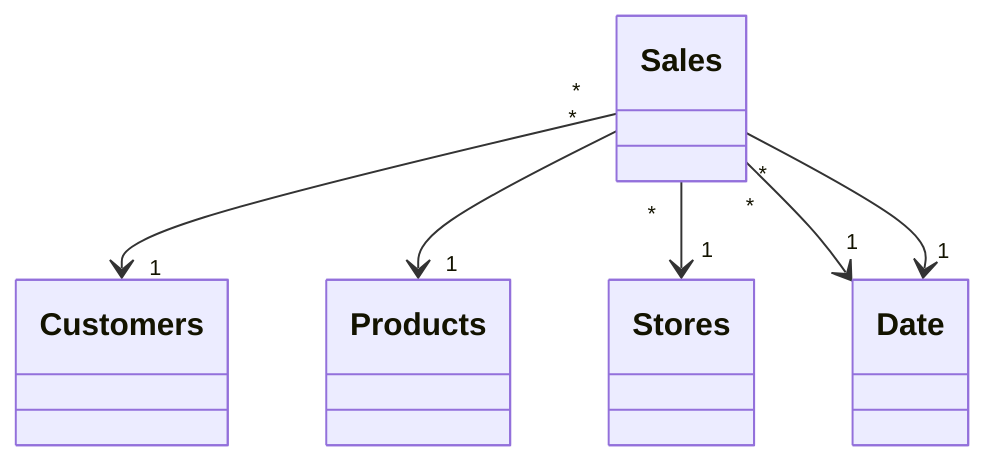

# Contoso Dataset

## Tables

- [Currency Exchange](tables/Currency%2520Exchange.md)
- [Customers](tables/Customers.md)
- [Date](tables/Date.md)
- [Info](tables/Info.md)
- [Products](tables/Products.md)
- [Sales](tables/Sales.md)
- [Stores](tables/Stores.md)

## Relationships

